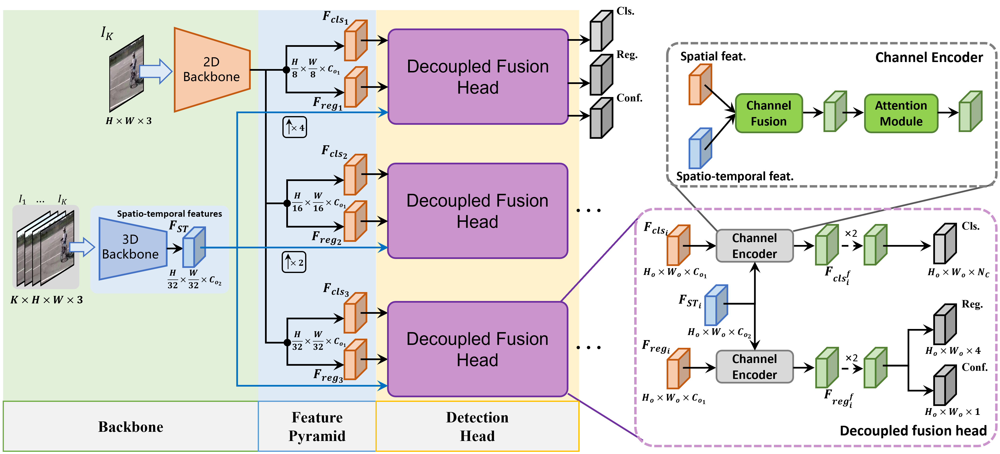

# YOWOv2: A Stronger yet Efficient Multi-level Detection Framework for Real-time Spatio-temporal Action Detection
English | [简体中文](https://github.com/yjh0410/YOWOv2/blob/master/README_CN.md)

非常感谢大家的star！YOWOv2是我业余时间做的一个尝试，是对上一代的YOWO的一次致敬。YOWO曾是我很喜欢的一个工作，但如今我已不再继续研究这一方向，因此，无法再回答大家的各种问题，对此，我深感抱歉，还望大家能够谅解。YOWOv2是一个完全开放的项目，不包含任何的license，因此，请尽管做任何你想做的改进或优化，无需经过我的同意。只要这个项目能对世界进步带去哪怕是微乎其微的促进和贡献，我也足够开心了~如果您觉得我们这个工作还行，不妨引用我们挂在Arxiv上的论文链接吧（在README的最下方）。

Thank you very much for everyone's star. YOWOv2 is an attempt I made in my spare time. It is a tribute to YOWO because I used to like YOWO very much. However, I am no longer deeply involved in the field of spatiotemporal motion detection, so I am not in a position to answer some of everyone's issues. For this, I am deeply sorry. YOWOv2 is a completely open spatiotemporal action detection project. I have not added any license to the project, so please feel free to do whatever you want without my consent. As long as my work can make even a small contribution to the progress of the world, I will be very happy. If you appreciate our recognition, you may wish to quote our article posted on Arxiv (at the bottom of README).

## Overview of YOWOv2



## Requirements
- We recommend you to use Anaconda to create a conda environment:
```Shell
conda create -n yowo python=3.6
```

- Then, activate the environment:
```Shell
conda activate yowo
```

- Requirements:
```Shell
pip install -r requirements.txt 
```

## Visualization


# Dataset

## UCF101-24:
You can download **UCF24** from the following links:

* Google drive

Link: https://drive.google.com/file/d/1Dwh90pRi7uGkH5qLRjQIFiEmMJrAog5J/view?usp=sharing

* BaiduYun Disk

Link: https://pan.baidu.com/s/11GZvbV0oAzBhNDVKXsVGKg

Password: hmu6 

## AVA
You can use instructions from [here](https://github.com/yjh0410/AVA_Dataset) to prepare **AVA** dataset.

# Experiment
* UCF101-24

|      Model     |  Clip  | GFLOPs |  Params | F-mAP | V-mAP |   FPS   |    Weight    |
|----------------|--------|--------|---------|-------|-------|---------|--------------|
|  YOWOv2-Nano   |   16   |  1.3   | 3.5 M   | 78.8  | 48.0  |   42    | [ckpt](https://github.com/yjh0410/YOWOv2/releases/download/yowo_v2_weight/yowo_v2_nano_ucf24.pth) |
|  YOWOv2-Tiny   |   16   |  2.9   | 10.9 M  | 80.5  | 51.3  |   50    | [ckpt](https://github.com/yjh0410/YOWOv2/releases/download/yowo_v2_weight/yowo_v2_tiny_ucf24.pth) |
|  YOWOv2-Medium |   16   |  12.0  | 52.0 M  | 83.1  | 50.7  |   42    | [ckpt](https://github.com/yjh0410/YOWOv2/releases/download/yowo_v2_weight/yowo_v2_medium_ucf24.pth) |
|  YOWOv2-Large  |   16   |  53.6 | 109.7 M | 85.2  | 52.0  |   30    | [ckpt](https://github.com/yjh0410/YOWOv2/releases/download/yowo_v2_weight/yowo_v2_large_ucf24.pth) |
|  YOWOv2-Nano   |   32   |  2.0   | 3.5 M   | 79.4  | 49.0  |   42    | [ckpt](https://github.com/yjh0410/YOWOv2/releases/download/yowo_v2_weight/yowo_v2_nano_ucf24_k32.pth) |
|  YOWOv2-Tiny   |   32   |  4.5   | 10.9 M  | 83.0  | 51.2  |   50    | [ckpt](https://github.com/yjh0410/YOWOv2/releases/download/yowo_v2_weight/yowo_v2_tiny_ucf24_k32.pth) |
|  YOWOv2-Medium |   32   |  12.7  | 52.0 M  | 83.7  | 52.5  |   40    | [ckpt](https://github.com/yjh0410/YOWOv2/releases/download/yowo_v2_weight/yowo_v2_medium_ucf24_k32.pth) |
|  YOWOv2-Large  |   32   |  91.9  | 109.7 M | 87.0  | 52.8  |   22    | [ckpt](https://github.com/yjh0410/YOWOv2/releases/download/yowo_v2_weight/yowo_v2_large_ucf24_k32.pth) |

*All FLOPs are measured with a video clip with 16 or 32 frames (224×224). The FPS is measured with batch size 1 on a 3090 GPU from the model inference to the NMS operation.*

**Qualitative results on UCF101-24**


* AVA v2.2

|     Model      |    Clip    |    mAP    |   FPS   |    weight    |
|----------------|------------|-----------|---------|--------------|
|  YOWOv2-Nano   |     16     |   12.6    |   40    | [ckpt](https://github.com/yjh0410/YOWOv2/releases/download/yowo_v2_weight/yowo_v2_nano_ava.pth) |
|  YOWOv2-Tiny   |     16     |   14.9    |   49    | [ckpt](https://github.com/yjh0410/YOWOv2/releases/download/yowo_v2_weight/yowo_v2_tiny_ava.pth) |
|  YOWOv2-Medium |     16     |   18.4    |   41    | [ckpt](https://github.com/yjh0410/YOWOv2/releases/download/yowo_v2_weight/yowo_v2_medium_ava.pth) |
|  YOWOv2-Large  |     16     |   20.2    |   29    | [ckpt](https://github.com/yjh0410/YOWOv2/releases/download/yowo_v2_weight/yowo_v2_large_ava.pth) |
|  YOWOv2-Nano   |     32     |   12.7    |   40    | [ckpt](https://github.com/yjh0410/YOWOv2/releases/download/yowo_v2_weight/yowo_v2_nano_ava_k32.pth) |
|  YOWOv2-Tiny   |     32     |   15.6    |   49    | [ckpt](https://github.com/yjh0410/YOWOv2/releases/download/yowo_v2_weight/yowo_v2_tiny_ava_k32.pth) |
|  YOWOv2-Medium |     32     |   18.4    |   40    | [ckpt](https://github.com/yjh0410/YOWOv2/releases/download/yowo_v2_weight/yowo_v2_medium_ava_k32.pth) |
|  YOWOv2-Large  |     32     |   21.7    |   22    | [ckpt](https://github.com/yjh0410/YOWOv2/releases/download/yowo_v2_weight/yowo_v2_large_ava_k32.pth) |

**Qualitative results on AVA**


## Train YOWOv2
* UCF101-24

For example:

```Shell
python train.py --cuda -d ucf24 --root path/to/dataset -v yowo_v2_nano --num_workers 4 --eval_epoch 1 --max_epoch 8 --lr_epoch 2 3 4 5 -lr 0.0001 -ldr 0.5 -bs 8 -accu 16 -K 16
```

or you can just run the script:

```Shell
sh train_ucf.sh
```

* AVA
```Shell
python train.py --cuda -d ava_v2.2 --root path/to/dataset -v yowo_v2_nano --num_workers 4 --eval_epoch 1 --max_epoch 10 --lr_epoch 3 4 5 6 -lr 0.0001 -ldr 0.5 -bs 8 -accu 16 -K 16 --eval
```

or you can just run the script:

```Shell
sh train_ava.sh
```

If you have multiple GPUs, you can launch DDP to train the YOWOv2, for example:

```Shell
python train.py --cuda -dist -d ava_v2.2 --root path/to/dataset -v yowo_v2_nano --num_workers 4 --eval_epoch 1 --max_epoch 10 --lr_epoch 3 4 5 6 -lr 0.0001 -ldr 0.5 -bs 8 -accu 16 -K 16 --eval
```

*However, I have not multiple GPUs, so I am not sure if there are any bugs, or if the given performance can be reproduced using DDP.*

##  Test YOWOv2
* UCF101-24
For example:

```Shell
python test.py --cuda -d ucf24 -v yowo_v2_nano --weight path/to/weight -size 224 --show
```

* AVA
For example:

```Shell
python test.py --cuda -d ava_v2.2 -v yowo_v2_nano --weight path/to/weight -size 224 --show
```

##  Test YOWOv2 on AVA video
For example:

```Shell
python test_video_ava.py --cuda -d ava_v2.2 -v yowo_v2_nano --weight path/to/weight --video path/to/video --show
```

Note that you can set ```path/to/video``` to other videos in your local device, not AVA videos.

## Evaluate YOWOv2
* UCF101-24
For example:

```Shell
# Frame mAP
python eval.py \
        --cuda \
        -d ucf24 \
        -v yowo_v2_nano \
        -bs 16 \
        -size 224 \
        --weight path/to/weight \
        --cal_frame_mAP \
```

```Shell
# Video mAP
python eval.py \
        --cuda \
        -d ucf24 \
        -v yowo_v2_nano \
        -bs 16 \
        -size 224 \
        --weight path/to/weight \
        --cal_video_mAP \
```

* AVA

Run the following command to calculate frame mAP@0.5 IoU:

```Shell
python eval.py \
        --cuda \
        -d ava_v2.2 \
        -v yowo_v2_nano \
        -bs 16 \
        --weight path/to/weight
```

## Demo
```Shell
# run demo
python demo.py --cuda -d ucf24 -v yowo_v2_nano -size 224 --weight path/to/weight --video path/to/video --show
                      -d ava_v2.2
```

**Qualitative results in real scenarios**


## References
If you are using our code, please consider citing our paper.

```
@article{yang2023yowov2,
  title={YOWOv2: A Stronger yet Efficient Multi-level Detection Framework for Real-time Spatio-temporal Action Detection},
  author={Yang, Jianhua and Kun, Dai},
  journal={arXiv preprint arXiv:2302.06848},
  year={2023}
}
```
